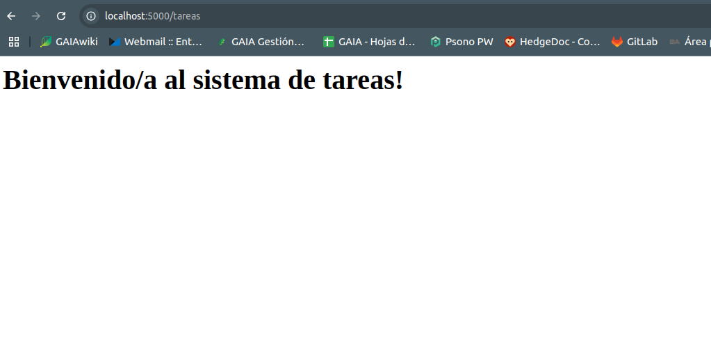

# PFO 2: Sistema de Gestión de Tareas con API y Base de Datos

### Materia: Programación sobre Redes

**Docente:** Alan Portillo
**Alumna:** Soledad Aldao

---

## Descripción

Este proyecto implementa un sistema básico de gestión de tareas con una API REST desarrollada en Flask y persistencia de datos en SQLite.  
Incluye registro y login de usuarios con contraseñas hasheadas, y un cliente en consola para interactuar con la API.

---

## Tecnologías usadas

-  Python 3.10+
-  Flask
-  Flask_SQLAlchemy
-  Werkzeug (para hasheo de contraseñas)
-  SQLite
-  Requests (cliente en consola)

---

## Instalación y ejecución

1. **Clonar el repositorio**

```bash
git clone git@github.com:solealdao/pfo2-aldao.git
cd gestor_tareas
```

2. **Crear y activar entorno virtual**

```bash
python3 -m venv venv
source venv/bin/activate
```

3. **Instalar dependencias**

```bash
pip install -r requirements.txt
```

4. **Levantar servidor**

```bash
python3 servidor.py
```

El servidor correrá en http://localhost:5000

5. **Ejecutar cliente consola en otra terminal**

```bash
python3 cliente.py
```

---

## Endpoints disponibles

| Método | Ruta              | Descripción                  |
| ------ | ----------------- | ---------------------------- |
| POST   | /registro         | Registro de usuario          |
| POST   | /login            | Inicio de sesión             |
| POST   | /tareas           | Agregar tarea                |
| GET    | /tareas/<usuario> | Listar tareas de un usuario  |
| GET    | /tareas           | Mensaje de bienvenida (HTML) |

---

## Uso con curl

Ejemplo para registrar usuario:

```bash
curl -X POST http://localhost:5000/registro \
-H "Content-Type: application/json" \
-d '{"usuario":"sole","contraseña":"1234"}'
```

Ejemplo para iniciar sesión:

```bash
curl -X POST http://localhost:5000/login \
-H "Content-Type: application/json" \
-d '{"usuario":"sole","contraseña":"1234"}'
```

---

## Respuestas conceptuales

1️⃣ **¿Por qué hashear contraseñas?**
Hashear contraseñas significa transformar la contraseña original en un valor cifrado que no se puede revertir a su forma original.
Esto permite proteger la privacidad y seguridad de los usuarios, ya que las contraseñas nunca se almacenan en texto plano. Esto evita que en caso de una brecha de seguridad los atacantes puedan obtener las contraseñas reales.
Si alguien accede a la base de datos, no podrá ver las contraseñas reales, solo los hashes, lo que reduce el riesgo de robo de datos o acceso indebido.

2️⃣ **Ventajas de usar SQLite en este proyecto**
SQLite es una base de datos ligera y sin necesidad de configuración de servidor, ideal para proyectos pequeños o pruebas.

-  Permite persistencia local fácil y rápida, con buena integración en Python.
-  Integración sencilla: funciona perfectamente con Python y Flask a través de SQLAlchemy.
-  Buen rendimiento: Para aplicaciones pequeñas o medianas, SQLite es rápido y eficiente.
-  Portabilidad: el archivo de la base de datos se puede compartir o usar en diferentes entornos sin complejidad.

---

## Capturas de pantalla





